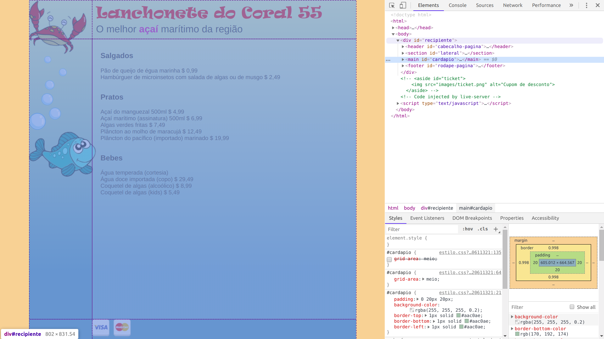

[](https://classroom.github.com/a/DaiZryIh)
# Lanchonete do Coral 55

[Baixe os arquivos aqui](https://github.com/fegemo/cefet-front-end-coral-55/archive/refs/heads/main.zip).
Um cardápio das gostosuras marítimas servidas na Lanchonete do Coral 55.
Se você **fizer os desafios**, **não deixe de avisar** quando entregar
a atividade!!

## Atividade

Você deve estilizar a página do cardápio (arquivo `index.html`) de forma a
implementar o _comprehensive layout_ criado por um _designer_ (arquivo
`coral55-comp.png`). Você deve usar a especificação do _layout_ (arquivo
`coral55-specs.png`).


### Diretrizes do Exercício

Aqui estão os itens que precisam ser implementados:

1. Inclua o arquivo `js/bubbles.js`. Veja no [FAQ](#faq).
1. Use `display: grid` para o _layout_ da página. Em particular, você
   deve usá-lo no elemento `#recipiente` para definir que a página tem
   2 colunas e 3 linhas.
1. Use `display: flex` para os elementos internos da página, como
   `#cabecalho-pagina`, `#rodape-pagina`, `#lateral` e também para cada `article`
1. Estude qual o melhor seletor CSS para cada situação.
1. Use espaçamento vertical duplo (_i.e._, propriedade `line-height`) para
   os itens do cardápio (`<article></article>`).
   - Veja o [slide sobre `line-height`][line-height]


### Exercício 1: layout da página (elemento `#recipiente`)

Vamos usar `display: grid` para dividir a página em 2 colunas e 3 linhas,
da seguinte forma:



...para tanto, vamos precisar de algumas propriedades CSS:
- No `#recipiente`:
    ```css
    #recipiente {
      /* ... */
      display: grid;                        /* para usar grid */
      grid-template-rows: ??? ??? ???;    /* altura das 3 linhas */
      grid-template-columns: ??? ???;     /* largura das 2 colunas */
    }
    ```
    - Sobre as **linhas** do grid:
      1. A _primeira_ deve ter a altura que ela precisar (valor: `auto`)
      1. A _segunda_ deve aproveitar todo o espaço disponível (valor: `1fr`)
      1. A _terceira_ deve ter a altura que ela precisar, ou você pode definir uma
         altura em pixels olhando para os _specs_ e fazendo uma continha
    - Sobre as **colunas** do grid:
      1. A _primeira_ deve ter exatamente `154px`
      1. A _segunda_ deve ocupar todo o espaço restante (valor: `1fr`)
- Em cada filho de `#recipiente`:
  ```css
  #cabecalho-pagina {
    grid-row: inicio / fim;       /* defina qual linha começa e qual termina */
    grid-column: inicio / fim;    /* idem, mas para coluna */
  }
  #lateral {
    /* ...defina linha e coluna */
  }
  #cardapio {
    /* ...defina linha e coluna */
  }
  #rodape-pagina {
    /* ...defina linha e coluna */
  }
  ```


### Exercício 2: cabeçalho (elemento `#cabecalho-pagina`)


Para estilizar o cabeçalho da página (`#cabecalho-pagina`), use Flexbox
com a direção de **coluna** (`flex-direction: ???`).

Além das propriedades colocadas no cabeçalho, em cada um dos filhos
de `#cabecalho-pagina` (ou seja, um `h1` e um `h2`), alinhe-o de maneira
que o `h1` fique centralizado e o `h2` fique à direita (conforme a imagem).
Isso deve ser feito como a propriedade `align-self: ???` que deve ser
colocada tanto no `h1` quanto no `h2`.


### Exercício 3: o cardápio (`#cardapio`)

Estilize cada item do `#cardápio` (ou seja, cada `article`) de maneira
a deixar o nome do item à esquerda e o preço à direita - use flexbox
no `article` para isso (não use float!!).

Após ter feito isso, aumente o espaçamento vertical entre os itens do
menu para um espaçamento duplo (veja [FAQ](#faq)) para dar um
"arejamento" ao  texto. Deve ficar assim:


### Exercício 4: rodapé (`#rodape-pagina`)

Estilize o rodapé considerando os _specs_. Use flexbox para posicionar
a imagem dos cartões à direita. Além disso, use propriedades como `margin`,
`padding`, `height` etc. para definir o espaçamento como solicitado.


### Exercício 5: seção lateral (`#lateral`)

Estilize a seção lateral, que contém as imagens do siri, da bolha e do
peixe, de maneira que o siri fique lá em cima, a bolha no meio e o peixe
lá em baixo: use flexbox.


### Desafio 1: _ticket_ (`#ticket`)

Em `index.html` há um código comentado que coloca um ticket na página.
Descomente esse código e, usando seus conhecimentos da propriedade `position`, estilize-o de maneira que mesmo se a página rolar, ele fique parado, fixado em sua posição, que é centralizada verticalmente.

Faça com que ele fique escondido, deslocado `-89px` (à esquera) e,
quando o mouse passar sobre ele, que ele se revele (ou seja, deslocado `0`).

Configure uma transição CSS para que o `#ticket` se movimente
de maneira animada. Para isso, veja o [FAQ](#faq).


### Desafio 2: deslocamentos das imagens

Como um retoque final, desloque as imagens do `#siri` e do `#peixe`,
conforme as specs. Esse deslocamento pode ser feito usando **posicionamento
relativo**.


### Desafio 3: alterando as borbolhas

Abra o arquivo `js/bubbles.js` e modifique o intervalo de surgimento das bolhas
para algo bem mais rápido!


### <abbr title="Frequently Asked Questions">FAQ</abbr>

- Para fazer uma **transição suave da posição** `left` de um elemento, usamos
  a propriedade `transition`:
  ```css
  #elemento {
    /* ... */
    left: -100px;
    transition: left 100ms ease-out; /* propriedade, duração, interpolação */
  }
  #element:hover {
    left: 0;
  }
  ```
- Para incluir um _script_ na página, coloque uma _tag_ `<script src="caminho-para-arquivo.js"></script>` no final do `<body>`, logo antes do `</body>`.
- Me esqueci das propriedades do Flexbox... onde acho? Há um excelente tutorial do site CSS Tricks: https://css-tricks.com/snippets/css/a-guide-to-flexbox/
- Me esqueci das propriedades do Grid... onde acho? Há um excelente tutorial do site CSS Tricks: https://css-tricks.com/snippets/css/complete-guide-grid/


[centralizacao-horizontal]: https://fegemo.github.io/cefet-front-end/classes/css5/#centralizacao-horizontal
[line-height]: https://fegemo.github.io/cefet-front-end/classes/css5/#line-height
