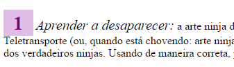

[](https://classroom.github.com/a/vcQmdv-0)
# cefet-web-ninjas

Duas páginas web explicando como se tornar um Ninja na vida real, com algumas
curiosidades sobre essa gente ligeira.

## Atividade

Você deve estilizar as duas páginas (arquivos `index.html` e
`curiosidades.html`) de forma a torná-los extremamente atrativos ao leitor
de páginas web exigente.

Você **tem liberdade para escolher as cores e os estilos** que melhor agradarem
aos olhos, respeitando o **bom senso** de como se espera a aparência de uma
página web (_i.e._, libere o artista dentro de você ;).

Assim, esta atividade propõe alguns **itens obrigatórios** e outros de
**sugestão** para guiar seu espírito artístico.

### Itens Obrigatórios

Aqui estão os itens que precisam ser implementados:

1. Logomarca
   - Reduzir o tamanho da logomarca (está muito grande) para `200px` de largura
     (`width`)
1. Todas as imagens e vídeos no corpo da página
   - Quebrar linha em vez de aparecer "dentro" do parágrafo
   - Centralizar (veja FAQ)
1. Todas as imagens (exceto logo - use o seletor de negação para isso)
   - Deixar com as bordas arrendondadas (procure na Web sobre a propriedade `border-radius`
1. Títulos da página (`<h1>` e `<h2>`)
   - Usar outra fonte, que não seja a padrão (`font-family`)
     - Você pode usar a ferramenta de desenvolvedor do navegador para ver
       possíveis valores de fonte
1. Hiperlinks
   - Estilize os hiperlinks em seus 4 estados diferentes (veja FAQ)
     - Sugestão: variar as propriedades `color` e/ou
       `text-decoration: underline` (sublinhado) e `text-decoration: none`
1. Links externos
   - Coloque um ícone de globo (`img/globo.png`) à esquerda dos
     hiperlinks que apontam para URLs externas
     - Dica: você pode usar esta imagem e você precisará das propriedades
      `background-image`, `background-repeat` (veja FAQ) e `padding-left`
      - Faça isso usando apenas CSS
      - Faça essa parte sem alterar o HTML (ou seja, sem usar classes/ids)
1. "Notas" (no passo 2 e nas referências)
   - Esmaeça (deixe mais "apagadinho") o texto das notas para que não chamem tanta atenção quanto o texto
     principal
     - você pode usar a cor da fonte para isso ou a propriedade opacity
1. Número do passo (para se tornar ninja)
   - Aumente a fonte e mude a cor e o fundo do número do passo
   - Aumente a fonte (_e.g._, `font-size: 20px`) do "nome do passo"

     

### Sugestões

Seguem algumas sugestões para melhorar o visual das páginas:

- Coloque um espaçamento (`padding` ou `margin`) na página inteira para deixar
  o conteúdo centralizado.
- Escolha uma cor de destaque (sei lá, um roxo forte) e estilize os elementos
  `<strong></strong>` e, talvez os títulos para terem essa cor
- Coloque uma cor de fundo na página que seja mais clara, mas contraste bem com
  a cor de destaque
- Use uma **fonte sem serifa** para o corpo do texto e deixe uma
  **fonte com serifa** para os títulos
- Justifique (alinhamento) o texto dos parágrafos com `text-align: justify`

### <abbr title="Frequently Asked Questions">FAQ</abbr>

- Centralizando uma ``:

  ```css
  img {
    display: block;
    margin-left: auto;
    margin-right: auto;
  }
  ```
  - Explicação do `margin`: atribuímos uma `margin` lateral com valor
    "automático", o que faz o navegador dividir o espaço lateral igualmente em 2
  - Explicação do `display: block`: uma `` é `inline` por padrão e
    elementos `inline` não são afetados por `margin` ou `padding`
- Estados de um hyperlink:
  - `a:link` - um link que nunca foi visitado
  - `a:visited` - um link que o usuário já visitou
  - `a:hover` - um link quando o mouse está em cima dele
  - `a:active` - um link no momento em que é "clicado"
- Imagem de fundo que não repete

  ```css
  body {
    background-image: url(img/nome-da-imagem.png);
    background-repeat: no-repeat;
    /*background-position: top left; */ /* este já é o valor padrão */
  }
  ```
